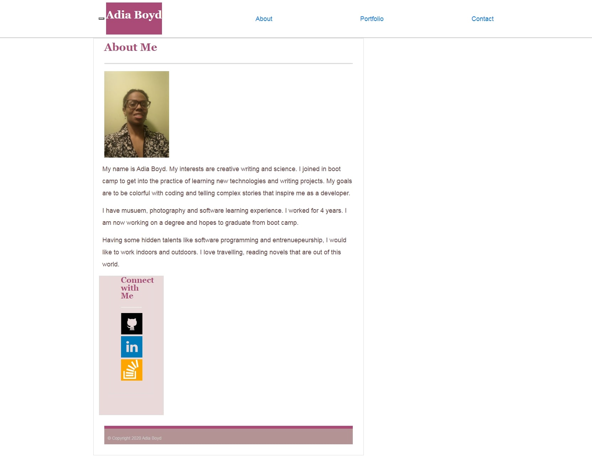

# CatchyCode
About the project: It is about me and my background. 

This is my portfolio that I created for this second project. The purpose is to know what a bootstrapped portfolio does, how make a responsive layout, executing github pages and understanding about media queries.
Building a navbar and grid system for my website, it helps to me to create my portfolio in different formats. I want to build flexibility and reliability for this project because I can do what I want to create with the images.

My motivation was to market myself and know who's my audience. Another motivation is to make a visual design that is pretty and understandable. 
Making a website is a reward and something that allows me to think about animation.  

Problem(s) it solve: Grammatical/Sytnax errors, Screening/Formatting issues, Sizing 

What I learn: To know how to put a sticky footer and semantic elements in CSS and HTML files properly 
This is my website. Check it out: https://codeyab22.github.io/CatchyCode/.

